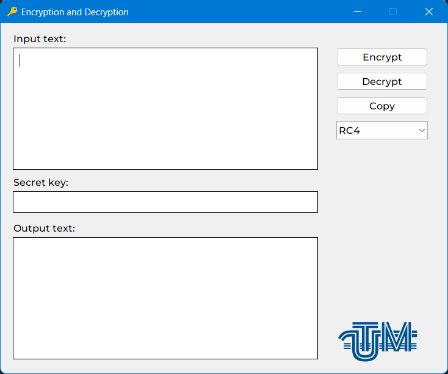

<h1>Encryption and Decryption Program</h1>

This project was created for the final work on the subject "Implementation of algorithms using structured programming" at the Technical University of Moldova.

Purpose: To show skills in working with any type of algorithms. 
The purpose of the project: To show the possibilities of the RC4, XOR, Atbash and Vigenere algorithms.

The application has a user interface, which is implemented using the Java Swing library. 
All encryption methods that are presented in this program are used purely for educational/informational purposes.

